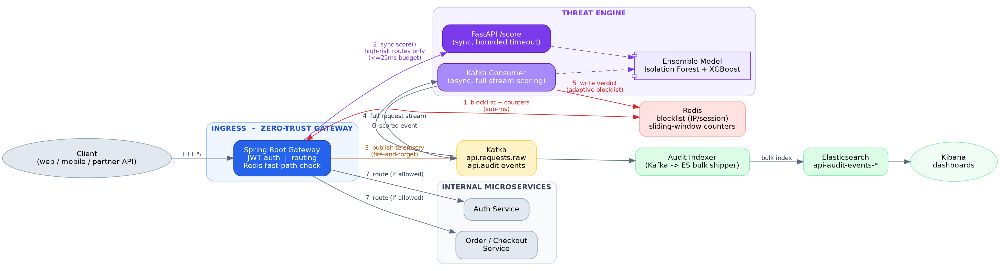

# AI-Powered Distributed API Security Firewall

A zero-trust API gateway that inspects streaming traffic in real time to detect
and block credential stuffing and business-logic abuse **before** it reaches
internal microservices — combining a Spring Boot ingress layer, a Kafka-backed
streaming pipeline, Redis-based sub-millisecond enforcement, and an ensemble
ML threat-scoring engine (Isolation Forest + XGBoost).



## Why this exists

Signature-based WAFs catch known attack strings. They cannot catch a
*sequence* of individually-valid requests (credential stuffing) or a
*single* request whose fields are semantically wrong but syntactically
perfect (a tampered price or a negative quantity). This project scores
**behavior**, not just payload shape, and does it at two speeds:

- **Synchronous, sub-25ms path** — Redis blocklist + rate counters, escalating
  to a bounded ML call only for high-risk endpoints.
- **Asynchronous, full-stream path** — a Kafka consumer scores every request
  with the full ensemble model and adaptively updates the Redis blocklist, so
  the *next* request from an offending identity is blocked on the fast path
  with zero added ML latency.

## Stack

| Component | Technology | Role |
|---|---|---|
| Ingestion | Apache Kafka (KRaft) | Queues request telemetry for non-blocking analysis |
| State tracking | Redis | Live blocklist + sliding-window rate counters, sub-ms |
| Routing | Spring Boot / Spring Cloud Gateway | Zero-trust ingress: JWT auth, dynamic routing |
| Threat engine | FastAPI + scikit-learn + XGBoost | Ensemble anomaly/attack scoring |
| Audit logging | Elasticsearch + Kibana | Full traffic + decision audit trail |
| Deployment | Docker Compose (+ sample K8s manifest) | Local orchestration / production path |

## Quickstart

```bash
git clone <this-repo>
cd ai-api-security-firewall

# configure the local-only JWT signing secret first
cp .env.example .env
# replace JWT_SECRET in .env with a random value before using this outside the demo

docker compose up -d --build
./scripts/setup_infra.sh          # provisions Kafka topics + ES index template/ILM

# get a token (the mock auth service accepts this demo credential only)
curl -X POST http://localhost:8080/api/auth/login \
  -H "Content-Type: application/json" \
  -d '{"username":"demo_user","password":"correct-horse-battery-staple"}'

# simulate attacks
python scripts/simulate_credential_stuffing.py --target http://localhost:8080
python scripts/simulate_business_logic_abuse.py --target http://localhost:8080 --token <JWT>

# verify the pipeline actually caught them
python scripts/query_audit_trail.py --es http://localhost:9200
# or open Kibana at http://localhost:5601
```

## Repository layout

```
gateway/            Spring Boot zero-trust API gateway
threat-engine/       FastAPI + ensemble ML scoring service
audit-indexer/       Kafka -> Elasticsearch bulk shipper
mock-services/        Stand-in auth/order microservices for the demo
elasticsearch/       Index template + ILM policy
scripts/             Attack simulations, load test, infra setup
k8s/                 Sample production deployment manifest
docker-compose.yml   Full local orchestration
```

## Full write-up

See `docs/BUILD_GUIDE.pdf` for the complete architecture rationale, design
trade-offs, ML methodology, and a walkthrough of every file in this repo.

## Known limitations (read before you claim this is production-ready)

- The model is trained on **synthetic** data with clean class separation —
  real traffic will overlap far more; retrain on real, labeled traffic before
  trusting the thresholds.
- `numeric-baselines` in `application.yml` are hand-configured per field; a
  real deployment should learn/calibrate these from historical data.
- `distinct_endpoints_60s` and `geo_velocity_kmph` are stubbed on the
  synchronous path to protect the latency budget — see the write-up.
- No mTLS between internal services in the Compose demo; see `k8s/` and the
  write-up's Production Hardening section.

## License

MIT — see `LICENSE`.
